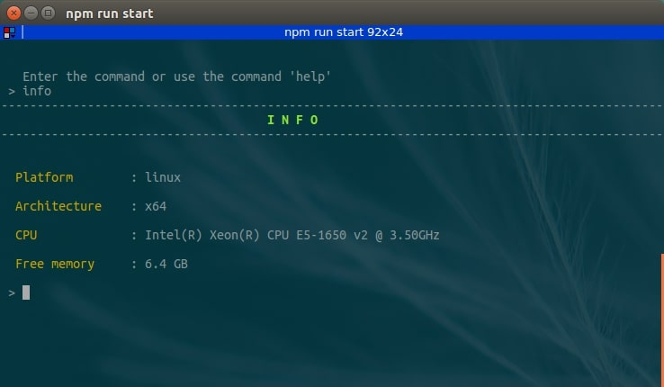
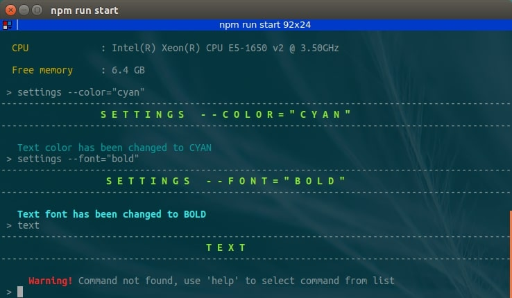

# Node  Example of work with the terminal (process)

NodeJs project for practicing working with the terminal. Use process and issuing commands in the terminal with information output to the command line.

### How to start app

first run the command `npm install` in terminal to install [faker.js](https://github.com/Marak/faker.js) library and then run program `npm run start`

### List of available commands

* author : developer of the program,
* dir : full path to the main file,
* exit : exit from the program,
* fill : filling an array of fake user data,
* help : The list of available commands,
* info : technical information about the server (computer),
* settings : change the settings of the text design (--color="blue", --font="bold")
  For example: `settings --color="cyan"` or `settings --font="underline"`
* version : version of product

